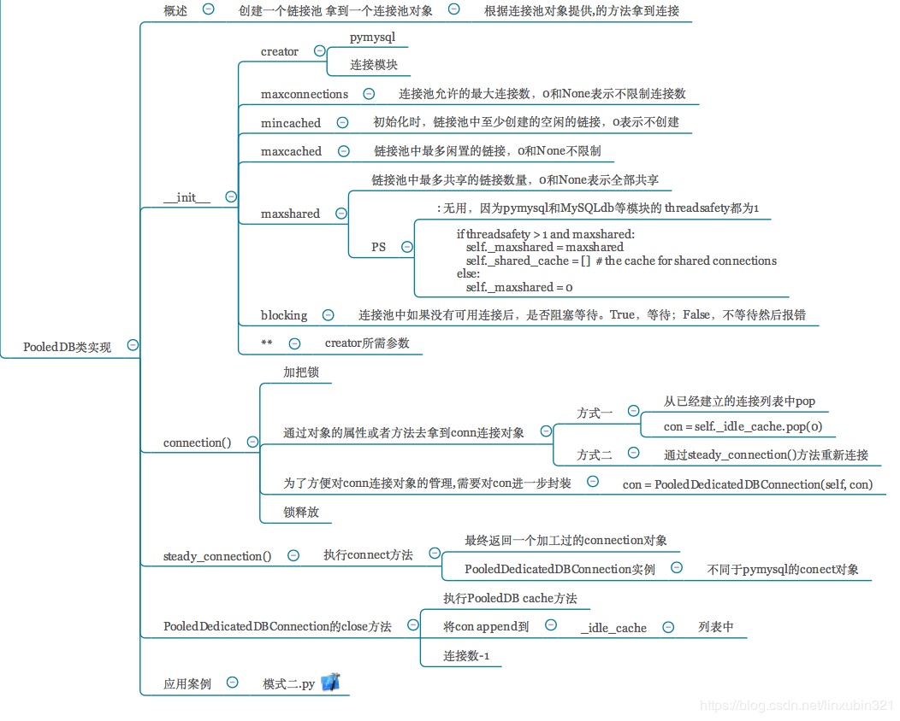

mysql单连接面对大量的插入与查询请求会不稳定，DBUtils是Python的一个用于实现数据库连接池的模块。

针对错误’Lost connection to MySQL server during query Connection reset by peer)’可采用连接池。

* PersistentDB ：提供线程专用的数据库连接，并自动管理连接。为每个线程创建一个连接，线程即使调用了close方法把连接重新放到连接池。
* PooledDB ：提供线程间可共享的数据库连接，并自动管理连接。创建一批连接到连接池，供所有线程共享使用。

1. maxconnections: 接池允许的最大连接数,0和None表示没有限制(默认)
2. mincached: 初始化时,连接池至少创建的空闲连接,0表示不创建
3. maxcached: 连接池中空闲的最多连接数,0和None表示没有限制
4. maxshared:连接池中最多共享的连接数量,0和None表示全部共享(其实没什么用)
5. blocking: 连接池中如果没有可用共享连接后,是否阻塞等待,True表示等等,False表示不等待然后报错
6. setsession: 开始会话前执行的命令列表
7. ping: ping Mysql服务器检查服务是否可用

## 防注入
```
1、通常执行
SQL = "SELECT * FROM scrapy_user_summary WHERE s_username='%s' and s_password_hash='%s'" % (username, password)
# 对该sql进行注入 username= ' or 1 -- ，--为注释后续语句
# SELECT * FROM scrapy_user_summary WHERE s_username='' or 1 -- ' and s_password_hash=''

2、用参数化方式，无需在%s两端加引号 , 内部执行参数化生成的SQL语句，对特殊字符进行了加\转义，避免注入语句生成。
```
## 补充
1、pymysql访问数据库线程安全问题(mysql error sql: Packet sequence number wrong - got 1 expected 2 for this sql query)

解决一：连接池，每个线程采用独立的connection

解决二：多线程同步加入锁控制信号量。
```
#set up a mutex
mutex = 0

# query for a fetchall
def qurey_all_sql(sql):
    while mutex == 1:
        time.sleep(500)
    mutex = 1        
    cur = connection.cursor()
    cur.execute(sql)
    result = cur.fetchall()
    connection.commit()
    cur.close()
    mutex = 0
    return result
```
2、connection对象方法

| 方法                   | 描述               |
|----------------------|------------------|
| begin()              | 开启事务             |
| commit()             | 提交事务             |
| cursor(cursor=None)  | 创建一个游标用来执行语句     |
| ping(reconnect=True) | 检查连接是否存活，会重新发起连接 |
| rollback()           | 回滚事务             |
| close()              | 关闭连接             |
| select_db(db)        | 选择数据库            |
| show_warnings()      | 查看warning信息      |

3、一图胜千言
